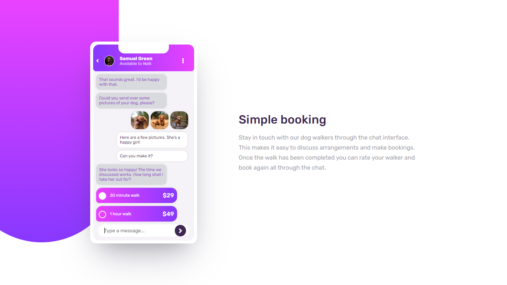

# Frontend Mentor - Chat app CSS illustration solution

This is a solution to the [Chat app CSS illustration challenge on Frontend Mentor](https://www.frontendmentor.io/challenges/chat-app-css-illustration-O5auMkFqY). Frontend Mentor challenges help you improve your coding skills by building realistic projects. 

## Table of contents

- [Overview](#overview)
  - [The challenge](#the-challenge)
  - [Screenshot](#screenshot)
  - [Links](#links)
- [My process](#my-process)
  - [Built with](#built-with)
  - [What I learned](#what-i-learned)
  - [Continued development](#continued-development)
  - [Useful resources](#useful-resources)
- [Author](#author)
- [Acknowledgments](#acknowledgments)

## Overview

### The challenge

Users should be able to:

- View the optimal layout for the component depending on their device's screen size
- **Bonus**: See the chat interface animate on the initial load

### Screenshot

### Links

- Solution URL: [solution site](https://www.frontendmentor.io/solutions/responsive-chat-app-website-using-html-and-css-with-animation-6JWVKvmMC)
- Live Site URL: [live site](https://islemmedjahdi.github.io/Chat-app-CSS-illustration/)

## My process

### Built with

- Semantic HTML5 markup
- Flexbox
- CSS Grid
- Media Queries CSS

### What I learned

- Making illustration using CSS

### Continued development
- adding chat interface animate on the initial load.

### Useful resources

## Author

- Frontend Mentor - [@IslemMedjahdi](https://www.frontendmentor.io/profile/IslemMedjahdi)
- Twitter - [@IslemMedjahdi](https://www.twitter.com/IslemMedjahdi)

## Acknowledgments
